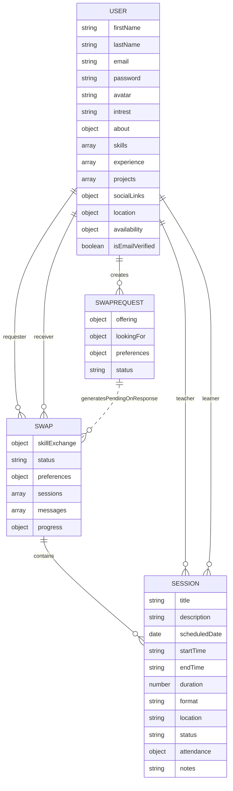
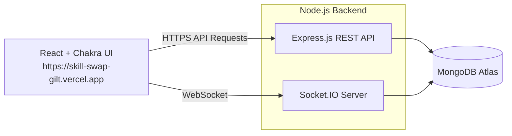
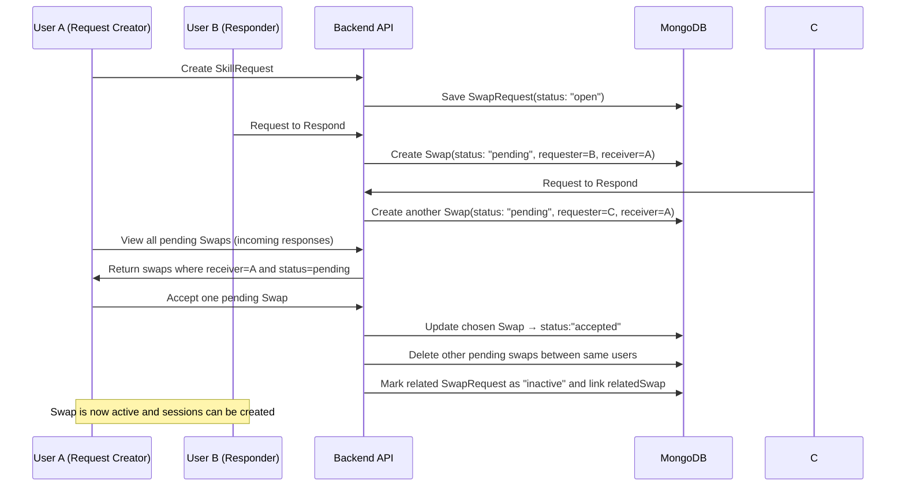
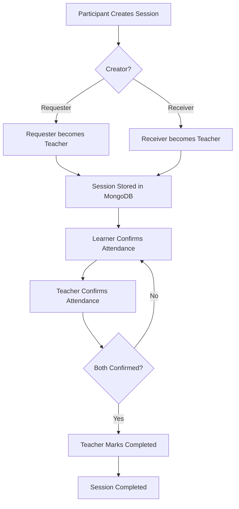
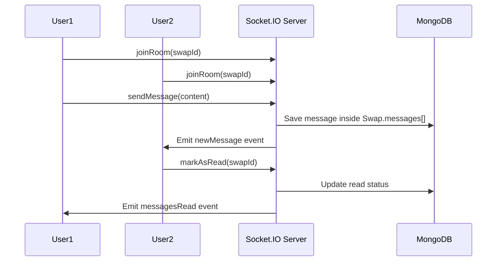

# SkillSwap — Peer-to-Peer Learning Platform

SkillSwap is a MERN-based platform that enables users to connect, learn, and teach skills directly to each other. The platform follows a structured skill-exchange workflow with user profiles, swap requests, responses, real-time chat, session scheduling, attendance confirmation, and complete swap lifecycle management.

Developer: **Nukala Sai Charan**

Live Deployment: https://skill-swap-gilt.vercel.app/

---

## Table of Contents

* Overview
* Core Features
* System Architecture
* User Profiles
* Skill Requests
* Swap Flow
* Real-Time Chat
* Session Management
* Technologies Used
* API Overview
* Folder Structure
* Future Enhancements
* How to Run Locally

---

# Overview

SkillSwap is designed for anyone who wants to learn or teach skills through a peer-to-peer model. Instead of traditional courses, two users exchange skills directly and schedule teaching sessions for each other. The platform handles matching, communication, session workflow, and swap completion.

---

# Core Features

### Authentication

* JWT access tokens
* BCrypt password hashing
* Email verification via OTP
* Secure protected routes

### User System

* Detailed user profiles
* Skills categorized by domain
* Projects, experience, social links
* Availability and timezone settings
* Profile visibility options

### Skill Requests

* Users post skill requests with:

  * Skill they want to learn
  * Skill they can teach
  * Experience level
  * Format preference
  * Session duration and frequency
* Others can respond to these requests
* Request creators can view all responses

### Swap Management

* Swap is created when:

  * A user responds to a request
  * OR a user directly sends a swap request
* Only the receiver can accept or reject
* Accepting a swap marks linked swap requests as matched/inactive
* Both users can then begin the swap

### Real-Time Chat

* Socket.IO-based real-time messaging
* Swap-specific chat rooms
* Online/offline status tracking
* Read receipts (messagesRead event)
* Chat list updates without refreshing

### Session Management

* Any participant can create a session
* Creator becomes the teacher for that session
* Learner is assigned automatically based on swap roles
* Session fields:

  * Title, description
  * Scheduled date & time
  * Duration
  * Format (online/offline/hybrid)
  * Location
  * Notes
* Attendance system:

  * Learner confirms attendance
  * Teacher confirms attendance
  * After both confirm, teacher can mark session as completed
* Sessions can be edited or cancelled by the teacher
* Notes can be added by both teacher and learner

### Swap Completion

* Each user sets the number of sessions they plan to teach
* Swap completes only when both users finish their required sessions
* Progress tracked individually
* All other pending swaps between both users are automatically removed

---

# System Architecture

### Backend

* Node.js
* Express.js
* MongoDB with Mongoose
* Socket.IO for real-time features

### Frontend

* React
* Chakra UI for UI components
* Axios for API calls

### Deployment

* Configurable via environment variables
* API and client can be deployed on any platform (e.g., Render, Vercel, Netlify)

---

# User Profiles

Based on the User model, profiles contain:

### Basic Information

* First name, last name
* Email
* Password (hashed)
* Avatar
* Interest

### About Section

* Intro
* Experience
* Quote

### Skills Section

* Skill categories
* List of skills per category
* Color scheme per category

### Experience Section

* Role
* Company
* Period
* Description
* Current status

### Projects Section

* Project name
* Technologies
* Description
* URL
* GitHub link
* Image
* Featured flag

### Social Links

* LinkedIn
* GitHub
* Portfolio
* Twitter
* Instagram

### Availability and Location

* City, country, timezone
* Available days
* Time slots
* Preferred learning format

### Activity Tracking

* isActive
* lastActive
* profileViews

---

# Skill Requests (SwapRequest)

A skill request contains:

* User who posted it
* Offering skill (what user can teach)
* LookingFor skill (what user wants to learn)
* Preferences (format, duration, frequency)
* List of responses
* Status: open, closed, matched

Responses to a request create a pending swap.

---

# Swap Flow

1. User A creates a skill request (SwapRequest with status "open").

2. Other users (B, C, D, …) click **"Request to Respond"** on A's request.
   - For each responder, the backend creates a **Swap** with:
     - requester = responder (e.g., User B)
     - receiver = request owner (User A)
     - status = "pending"
     - skillExchange based on the original request

3. User A sees all incoming **pending Swaps** where they are the receiver.
   - This represents all the "Request to Respond" actions they have received.

4. User A chooses one pending Swap and **accepts** it.
   - Only the receiver can accept.
   - The accepted Swap's status becomes "accepted".
   - Other pending swaps involving the same users are cleaned up.
   - Related skill requests for both users are marked inactive and linked to this Swap.

5. Once a Swap is accepted:
   - Both users can configure how many sessions they will teach.
   - They can start creating and attending sessions.
   - When both finish their planned sessions, the Swap can be marked as "completed".

---

# Real-Time Chat

Based on Socket.IO (server.js):

### Features:

* Online/offline tracking per user
* Swap-specific rooms
* Read receipts
* Live chat updates
* Swap list updates (last message preview)
* Messages stored inside Swap model

Room structure:

* One room per swap ID
* Users join when entering chat

---

# Session Management

### Who can create a session?

Any participant.

### Teacher Assignment

The creator of the session automatically becomes the teacher.

### Learner Assignment

The other participant becomes learner.

### Editing

Only teacher can edit a session.

### Cancelling

Only teacher can cancel a session.

### Notes

Both teacher and learner can add notes.

### Attendance Flow

1. Learner confirms attendance
2. Teacher confirms attendance
3. Teacher marks session as completed

### Completion Validation

Backend verifies attendance and status before allowing completion.

---

# Technologies Used

### Backend

* Node.js
* Express.js
* MongoDB
* Mongoose
* Socket.IO
* JWT
* Bcrypt
* Nodemailer

### Frontend

* React
* Chakra UI
* Axios

---

# API Overview

You can extend this section, but the core available routes:

### Authentication

* POST /api/auth/register
* POST /api/auth/login
* POST /api/auth/verify-otp

### Users

* GET /api/users/profile
* PUT /api/users/update

### Swap Requests

* POST /api/swap-requests
* GET /api/swap-requests
* POST /api/swap-requests/respond
* POST /api/swap-requests/:id/accept

### Swaps

* POST /api/swaps
* GET /api/swaps
* POST /api/swaps/:id/accept
* POST /api/swaps/:id/reject
* POST /api/swaps/:id/cancel
* POST /api/swaps/:id/complete
* POST /api/swaps/:id/messages

### Sessions

* POST /api/sessions
* GET /api/sessions/swap/:swapId
* PUT /api/sessions/:sessionId
* POST /api/sessions/:sessionId/attendance
* POST /api/sessions/:sessionId/status
* DELETE /api/sessions/:sessionId

---

# Folder Structure (Recommended)

```
/backend
  /controllers
  /models
  /routes
  /services
  server.js

/frontend
  /components
  /pages
  /hooks
  /styles
  App.js
```

---

# Future Enhancements

* File and image support in chat
* Typing indicators
* Session reminders via email
* Skill recommendation system
* User rating system (already partially in model)
* Admin dashboard for monitoring swaps

---

# How to Run Locally

### Backend

```
cd backend
npm install
npm start
```

### Frontend

```
cd frontend
npm install
npm run dev
```

### Environment Variables

Backend requires:

* MONGO_URI
* JWT_SECRET
* EMAIL_USERNAME
* EMAIL_PASSWORD
* CLIENT_URL


1. **ER Diagram** (Users, SwapRequests, Swaps, Sessions)
2. **System Architecture Diagram** (Frontend → Backend → DB + Socket Layer)
3. **Swap Lifecycle Diagram**
4. **Session Workflow Diagram**
5. **Real-Time Chat Flow Diagram**

# 1. ER Diagram (Mermaid)



---

# 2. System Architecture Diagram (Mermaid)



---

# 3. Swap Lifecycle Diagram



---

# 4. Session Workflow Diagram



---

# 5. Real-Time Chat Flow (Socket.IO)




